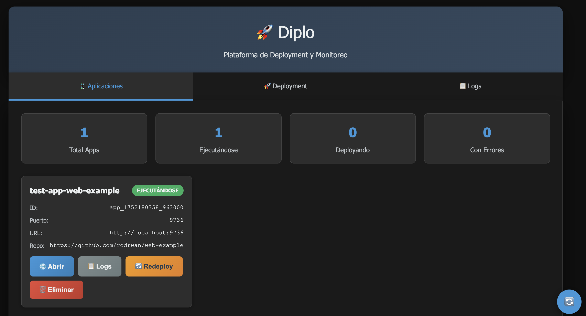
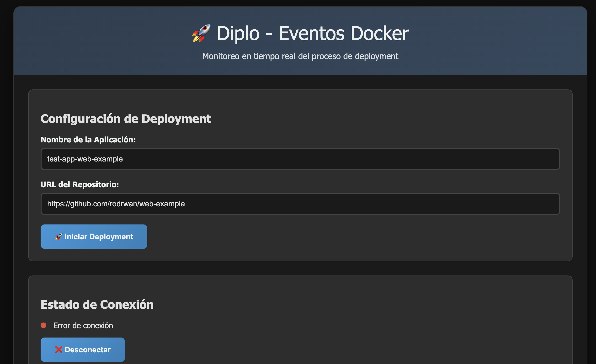
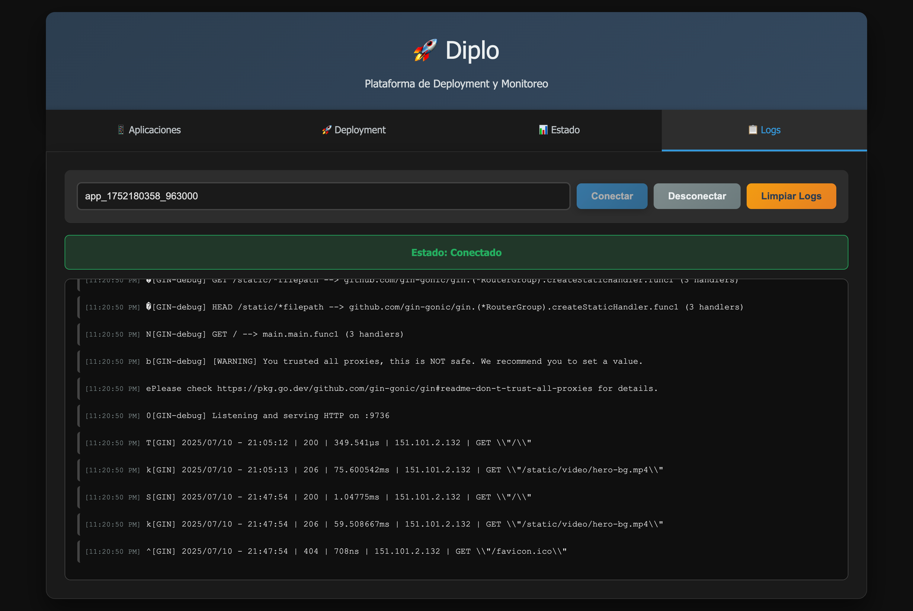

# Diplo - PaaS Local en Go

> 🚀 **Plataforma de deployment automático** desde repositorios Git usando Docker con interfaz web intuitiva y monitoreo en tiempo real

Diplo es una plataforma como servicio (PaaS) local escrita en Go que permite desplegar aplicaciones desde repositorios Git usando contenedores Docker, con una interfaz web moderna para gestión y monitoreo.

## ✨ Características Principales

### 🌐 **Interfaz Web Unificada**
- Dashboard moderno con tema oscuro
- Navegación intuitiva entre Apps, Deployment y Logs
- Gestión visual de aplicaciones desplegadas
- Monitoreo en tiempo real con Server-Sent Events (SSE)

### 🚀 **Deployment Automático**
- Deployment desde repositorios Git con un clic
- Detección automática de lenguajes (Go, Node.js, Python)
- Generación automática de Dockerfiles
- Asignación automática de puertos

### 📊 **Monitoreo y Gestión**
- Logs en tiempo real de aplicaciones
- Estados de deployment visibles
- Métricas de aplicaciones (ejecutándose, deployando, errores)
- Acciones rápidas (redeploy, eliminar, abrir app)

### 🔧 **Arquitectura Robusta**
- API REST completa con soporte CORS
- Base de datos SQLite para persistencia
- Integración nativa con Docker API
- Shutdown graceful con manejo de señales
- Logging estructurado con logrus

## 🖥️ Capturas de Pantalla

### Dashboard Principal


### Proceso de Deployment


### Monitoreo de Logs


## 🚀 Inicio Rápido

### Prerrequisitos
- Go 1.21 o superior
- Docker Engine
- Git

### Instalación
```bash
# Clonar el repositorio
git clone https://github.com/rodrwan/diplo.git
cd diplo

# Instalar dependencias y compilar
make build

# Ejecutar
make run
```

### Acceso a la Interfaz Web
```bash
# Abrir en tu navegador
http://localhost:8080
```

## 🌟 Uso

### Via Interfaz Web
1. **Accede a** `http://localhost:8080`
2. **Navega a "Deployment"** para desplegar una nueva app
3. **Ingresa el repositorio Git** y nombre de la aplicación
4. **Monitorea en tiempo real** el proceso de deployment
5. **Gestiona tus apps** desde la sección "Aplicaciones"

### Via API REST
```bash
# Desplegar aplicación
curl -X POST http://localhost:8080/api/v1/deploy \
  -H "Content-Type: application/json" \
  -d '{
    "repo_url": "https://github.com/user/my-app.git",
    "name": "my-app"
  }'

# Listar aplicaciones
curl http://localhost:8080/api/v1/apps

# Logs en tiempo real (SSE)
curl http://localhost:8080/api/v1/apps/{app-id}/logs
```

## 📁 Estructura del Proyecto

```
diplo/
├── cmd/diplo/                 # Punto de entrada
├── internal/
│   ├── database/             # Capa de datos SQLite + SQLC
│   ├── docker/               # Cliente Docker
│   ├── models/               # Modelos de datos
│   ├── server/               # Servidor HTTP
│   │   └── handlers/         # Handlers REST + SSE
│   └── templates/            # Templates HTML (templ)
├── docs/                     # Documentación
├── scripts/                  # Scripts de utilidad
└── Makefile                  # Comandos de build
```

## 🛠️ Tecnologías Utilizadas

- **Backend**: Go, Gorilla Mux, SQLite, SQLC
- **Frontend**: HTML5, CSS3, JavaScript, Server-Sent Events
- **Templates**: [templ](https://templ.guide/) para templates type-safe
- **Containerización**: Docker API
- **Logging**: Logrus
- **Base de Datos**: SQLite con migraciones SQL

## 🔧 Comandos de Desarrollo

```bash
# Desarrollo con hot reload
make dev

# Ejecutar tests
make test

# Generar templates
make generate

# Limpiar archivos generados
make clean

# Ver todos los comandos
make help
```

## 🌍 Lenguajes Soportados

| Lenguaje | Detección | Dockerfile | Estado |
|----------|-----------|------------|---------|
| Go       | `go.mod`  | ✅ Multi-stage | ✅ |
| Node.js  | `package.json` | ✅ Alpine | ✅ |
| Python   | `requirements.txt` | ✅ Alpine | ✅ |
| Java     | `pom.xml` / `build.gradle` | 🔄 Próximamente | 🔄 |
| Rust     | `Cargo.toml` | 🔄 Próximamente | 🔄 |

## 🤝 Contribuir

Las contribuciones son bienvenidas! Para contribuir:

1. Fork el proyecto
2. Crea tu rama feature (`git checkout -b feature/AmazingFeature`)
3. Commit tus cambios (`git commit -m 'Add some AmazingFeature'`)
4. Push a la rama (`git push origin feature/AmazingFeature`)
5. Abre un Pull Request

## 📝 Licencia

Este proyecto está bajo la Licencia MIT. Ver [LICENSE](LICENSE) para más detalles.

## 🚧 Roadmap

- [ ] 🔐 Autenticación y autorización
- [ ] 📊 Métricas avanzadas (Prometheus)
- [ ] 🔄 Webhooks para CI/CD
- [ ] 📦 Soporte para más lenguajes
- [ ] 🌐 Reverse proxy integrado
- [ ] 💾 Volúmenes persistentes
- [ ] ⚙️ Variables de entorno por app
- [ ] 📈 Autoscaling basado en carga

## 🆘 Soporte

Si tienes preguntas o necesitas ayuda:
- 📝 Abre un [Issue](https://github.com/rodrwan/diplo/issues)
- 💬 Inicia una [Discusión](https://github.com/rodrwan/diplo/discussions)
- 📧 Contacta al mantenedor

---

<div align="center">
  <strong>Hecho con ❤️ en Go</strong>
  <br>
  <sub>Diplo - Simplificando deployments locales</sub>
</div> 